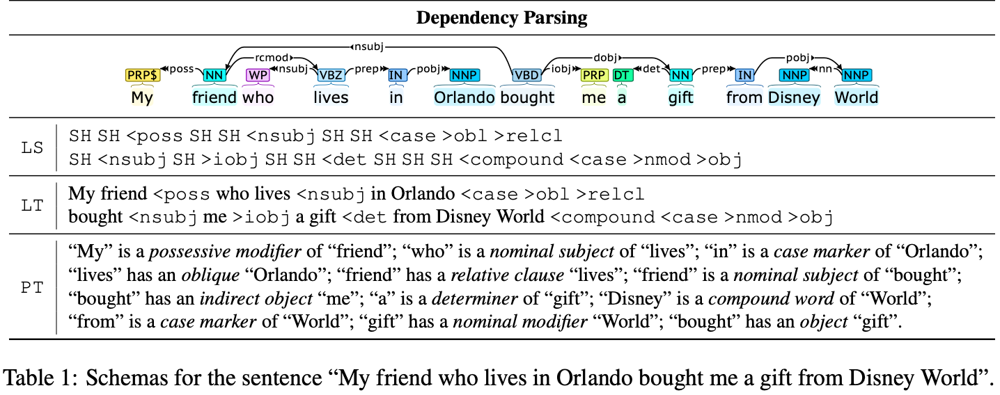

# Sequence-to-Sequence CoreNLP

Codes for our paper *[Unleashing the True Potential of Sequence-to-Sequence Models for Sequence Tagging and Structure Parsing](https://arxiv.org/abs/2302.02275)* published to [TACL 2023](https://transacl.org/). 



## Installation

Run the following setup script. Feel free to install [a GPU-enabled PyTorch](https://pytorch.org/get-started/locally/) (`torch>=1.6.0`).

```bash
python3 -m venv env
source env/bin/activate
ln -sf "$(which python2.7)" env/bin/python
pip install -e .
export PYTHONPATH=.:$PYTHONPATH
```

## Data Pre-processing

Download OntoNotes 5 ([`LDC2013T19.tgz`](https://catalog.ldc.upenn.edu/LDC2013T19)) and put it into the following directory:

```bash
mkdir -p ~/.elit/thirdparty/catalog.ldc.upenn.edu/LDC2013T19/
cp LDC2013T19.tgz ~/.elit/thirdparty/catalog.ldc.upenn.edu/LDC2013T19/LDC2013T19.tgz
```

That's all. ELIT will automatically do the rest for you the first time you run a training script.

## Experiments

Training and evaluation scripts are grouped in `tests` following the pattern: `tests/{pos|ner|con|dep}/{ptb|conll|ontonotes}/{ls|lt|pt}.py`.

For example, the script for `POS-LS` on PTB can be executed via:

```bash
python3 tests/pos/ptb/ls.py
```


## Citation

If you use this repository in your research, please kindly cite our TACL 2023 paper:

```bibtex
@article{he-choi-2023-seq2seq,
    title = "Unleashing the True Potential of Sequence-to-Sequence Models for Sequence Tagging and Structure Parsing",
    author = "He, Han and Choi, Jinho D.",
    journal = "Transactions of the Association for Computational Linguistics",
    year = "2023",
    address = "Cambridge, MA",
    publisher = "MIT Press",
    abstract = "Sequence-to-Sequence (S2S) models have achieved remarkable success on various text generation tasks. However, learning complex structures with S2S models remains challenging as external neural modules and additional lexicons are often supplemented to predict non-textual outputs. We present a systematic study of S2S modeling using contained decoding on four core tasks: part-of-speech tagging, named entity recognition, constituency and dependency parsing, to develop efficient exploitation methods costing zero extra parameters. In particular, 3 lexically diverse linearization schemas and corresponding constrained decoding methods are designed and evaluated. Experiments show that although more lexicalized schemas yield longer output sequences that require heavier training, their sequences being closer to natural language makes them easier to learn. Moreover, S2S models using our constrained decoding outperform other S2S approaches using external resources. Our best models perform better than or comparably to the state-of-the-art for all 4 tasks, lighting a promise for S2S models to generate non-sequential structures. ",
}
```